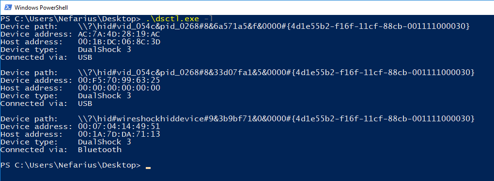
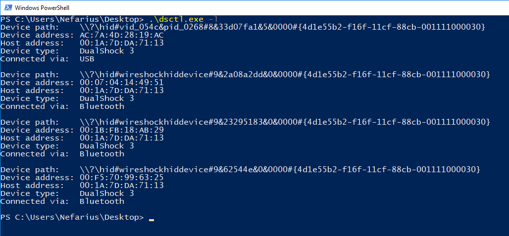
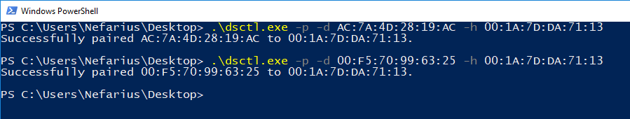

# DualShock Control Utility (dsctl)

## About

The command line tool `dsctl` can interact with devices running under the `FireShock`/`WireShock` driver pair. It can query devices for certain details, retreive and update configuration properties and more.

Attention: `dsctl` is currently under heavy development and evolving along the companion drivers. It might malfunction dependig on the build you use.

## Use Cases

### List details about connected devices

Fetch information about connected devices with `dsctl -l`. Example output:





### Pair device to new Bluetooth host

Use the `Device address` with the `-d` argument and enter the new Bluetooth host MAC address with `-h`. Examples:

`dsctl -p -d XX:XX:XX:XX:XX:XX -h XX:XX:XX:XX:XX:XX`



## Adapt driver configuration

With `dsctl -c` configuration properties of the device driver can be fetched and optionally updated. These properties typically change certain behaviours of the device.

### Change HID device mode

To increase compatibility with existing APIs and Software, the device can present itself in either `single` (all standard buttons and axes are presented as one Gamepad device, including sliders for pressure values) or `multi` (standard buttons and axes as Gamepad, pressure axes as 2nd Joystick device) mode.

The standard mode is `single`. It can be changed with the `--device-mode` argument.

Example changing to `single` mode:

```PowerShell
dsctl -c -d XX:XX:XX:XX:XX:XX --device-mode single
```

Example changing to `multi` mode:

```PowerShell
dsctl -c -d XX:XX:XX:XX:XX:XX --device-mode multi
```

Attention: changing this property requires reconnecting the affected device afterwards.

### Mute digital button state changes

This feature is especially useful if you're binding/mapping pressure sensitive buttons in applications. Due to the mechanical design of certain controllers, the state change of the digital button (pressed, not pressed) is reported earlier than the changing axis value (pressure level), therefore the digital button "wins" the assignment over the pressure axis. To circumvent this the digital button states can be "muted" (a.k.a. no more stat changes will be reported) with the `--mute-buttons` option.

Example muting buttons:

```PowerShell
dsctl -c -d XX:XX:XX:XX:XX:XX --mute-buttons yes
```

Example unmuting buttons (restoring default behaviour):

```PowerShell
dsctl -c -d XX:XX:XX:XX:XX:XX --mute-buttons no
```

Hint: this change becomes active immediately.
