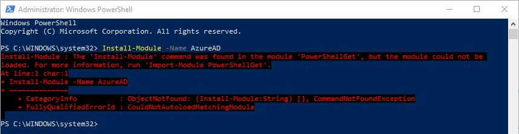
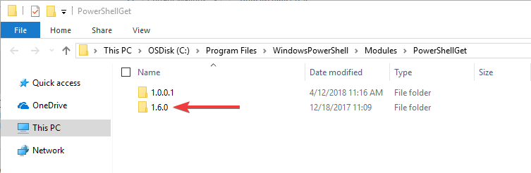
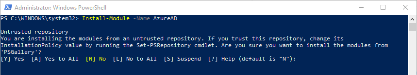
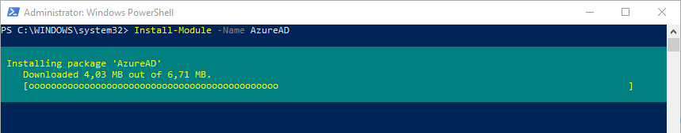
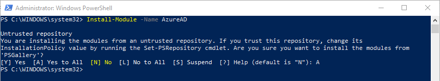

# Fix Install-Module not found in PowerShellGet

## About

The cmdlet `Install-Module` can sometimes (especially after a major OS upgrade) break with this vague message:

This cmdlet is provided by the module [PowerShellGet](https://github.com/PowerShell/PowerShellGet) which is redistributed with the official PowerShell installation. If you're experiencing this issue, try the following.

## The fix

Navigate to the file system path `C:\Program Files\WindowsPowerShell\Modules\PowerShellGet` where you may see the following directories:

If you see one or more folders named **differently** than  `1.0.0.1`, delete them. Re-open PowerShell and the the installation again. It should now display the expected consent message:

After confirmation the download and installation will work again.

That's it 😊