# Manual removal of ScpToolkit residue

Hint: ongoing draft 🙃

## About

This article will walk you through the process of removing any traces of various versions of [ScpToolkit](https://github.com/nefarius/ScpToolkit) from your machine 😊

## Stop processes, remove the service

Attention: make sure to run the following commands in an [administrative prompt](https://www.thewindowsclub.com/how-to-run-command-prompt-as-an-administrator)!

The following commands terminate all SCP components that might currently run:

```shell
taskkill /F /IM ScpServer.exe
taskkill /F /IM ScpMonitor.exe
taskkill /F /IM ScpTrayApp.exe
```

Should look similar to this output (notice that the server wasn't running, therefore displaying an error):

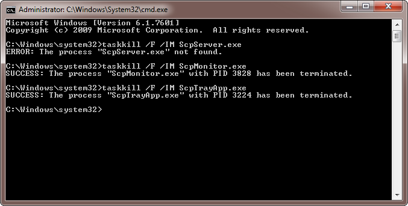

If none were running, that's perfectly fine, just continue.

Now let's stop and delete the background service:

```shell
sc stop Ds3Service
sc delete Ds3Service
```

Resulting in:

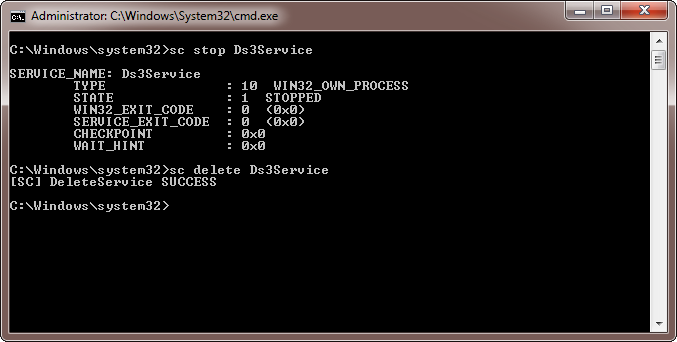

Hint: depending on your installation, the service might not be installed. In that case, just ignore reported errors.

## Remove drivers from v1.6

Attention: for this procedure to work properly make sure you've got your controller(s) and Bluetooth dongle(s) connected. If you don't have enough USB ports just repeat the described steps for each device, plugging it in one after another.

Download and run the [DriverStore Explorer](https://github.com/lostindark/DriverStoreExplorer/releases/latest) tool. We'll use this to safely remove the driver files from the system. Make sure to run it with administrative permissions!

You'll be presented with a list of drivers found on your machine:

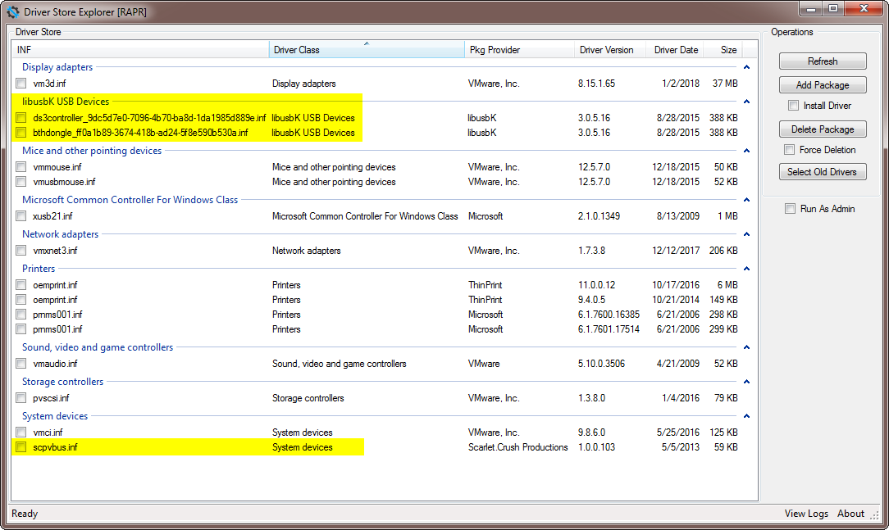

The highlighted entries belong to the toolkit installation. Select those, tick the `Force Deletion` box on the right and then click `Delete Package`:

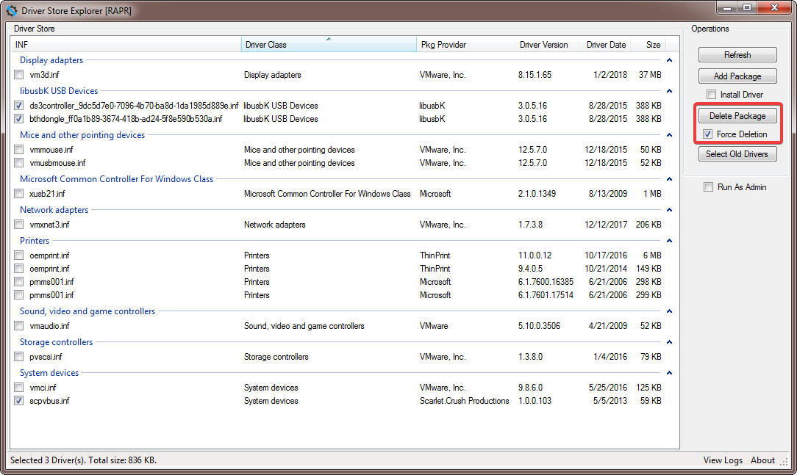

Confirm the, uhm, confirmation 😃

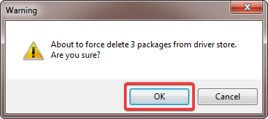

A few moments later they shall be gone:

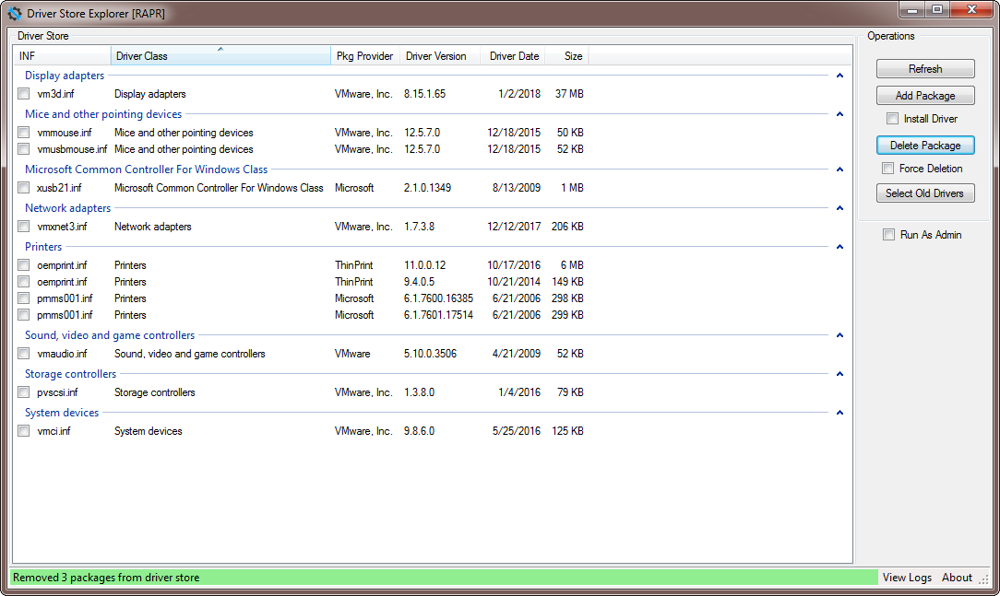

Sweet! Now we need to instruct Windows to revert the devices to their default drivers. Open [Device Manager](https://www.lifewire.com/how-to-open-device-manager-2626075) and look for a node titled `libusbK USB Devices`:

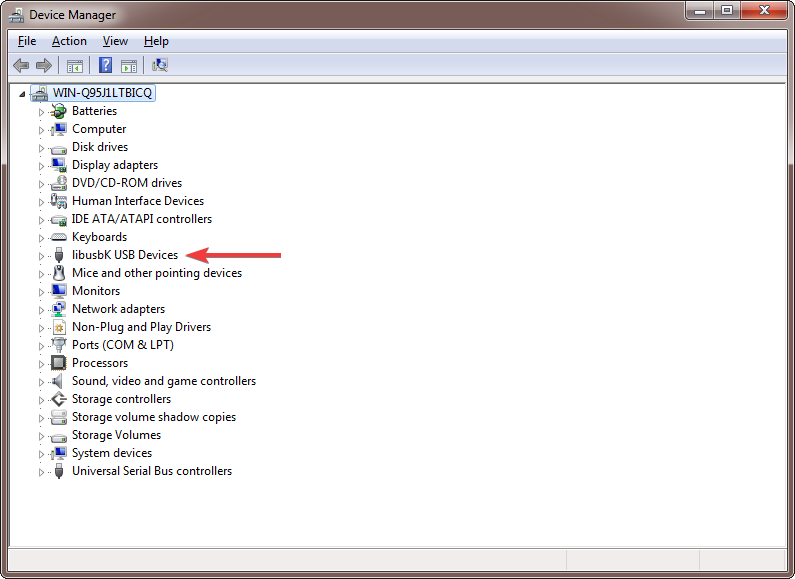

Expanding said node shall reveal the devices running under SCP's drivers:

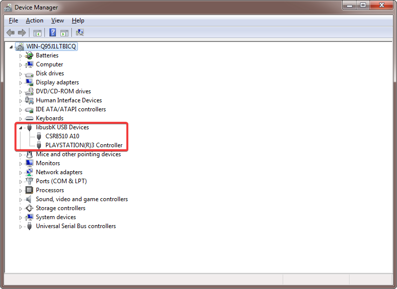

Right-click on each of theose and select `Uninstall`:

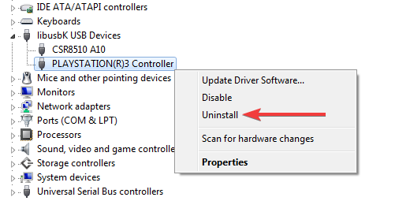

We're sure we wanna do that 😋

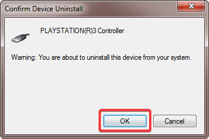

Same goes for the Bluetooth host:

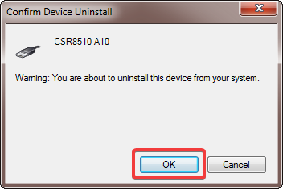
