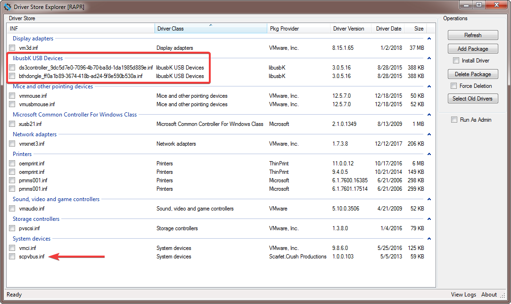

# Manual removal or ScpToolkit residue

## Stop processes, remove the service

Attention: make sure to run the following commands in an [administratove prompt](https://www.thewindowsclub.com/how-to-run-command-prompt-as-an-administrator)!

The following commands terminate all SCP components that might currently run:

```shell
taskkill /F /IM ScpServer.exe
taskkill /F /IM ScpMonitor.exe
taskkill /F /IM ScpTrayApp.exe
```

Should look similar to this output (notice that the server wasn't running, therefore displaying an error):


If none were running, that's perfectly fine, just continue.

Now let's stop and delete the background service:

```shell
sc stop Ds3Service
sc delete Ds3Service
```

Resulting in:


Hint: depending on your installation, the service might not be installed. In that case, just ignore reported errors.




