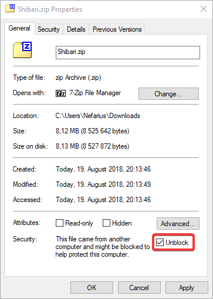
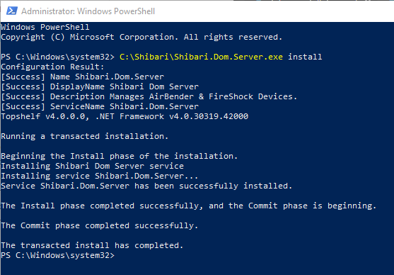
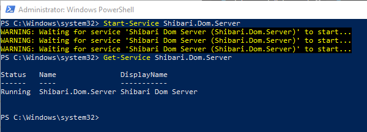

# Shibari installation instructions

Attention: `Shibari` isn't a finished product nor is it a drop-in replacement for the [ScpToolkit](https://github.com/nefarius/ScpToolkit) and it never will be. `Shibari` is an ongoing test platform and [proof of concept](https://en.wikipedia.org/wiki/Proof_of_concept) for dispatching input and output data between gaming peripherals. It's currently used to translate data between [FireShock **Gen2**](https://github.com/ViGEm/FireShock), [AirBender](https://github.com/ViGEm/AirBender) and `ViGEm`.

## Target audience

You're running Windows **8.1 or 10**, wanna use your DualShock 3 controller in pretty much any game and can't run/don't want to deal with ScpToolkit. You might give this a shot then 😊

## Prerequisites

Make sure all of the following conditions are met and all dependencies are installed.

- Microsoft Windows **8.1/10** x86 or x64
  - You read right, unfortunately no Windows 7/8 support 😔
- Microsoft Visual C++ Redistributable for Visual Studio 2017 ([x64](https://go.microsoft.com/fwlink/?LinkId=746572), [x86](https://go.microsoft.com/fwlink/?LinkId=746571))
- [.NET Framework 4.5.2](https://www.microsoft.com/en-ca/download/details.aspx?id=42642) (already included in Windows 8.1/10)
- [Windows Management Framework 5.1](https://docs.microsoft.com/en-us/powershell/wmf/5.1/install-configure) (already included in Windows 10)

## Installation guide

If you can follow a cooking recipe the following section should be a piece of cake 😉 If you can't cook, well, learn it, it's about time 😲 Alright, here we go.

### Get all the files

Attention: after you downloaded the archives, [make sure to unblock them](https://blogs.msdn.microsoft.com/delay/p/unblockingdownloadedfile/) *before* extraction!

- Get the latest `Shibari.zip` [from here](https://buildbot.vigem.org/builds/Shibari/master/) (always pick the highest version number for most recent release)
- Get the latest `FireShock.zip` (version **2**.X.X.X) [from here](https://downloads.vigem.org/projects/FireShock/stable/)
  - This is required for USB connection
- (Optional) Get the latest `AirBender.zip` [from here](https://downloads.vigem.org/projects/AirBender/stable/)
  - This is required for Bluetooth connection
- Unblock all the archives. If you forget that, weird things may happen 🙁
  
- Extract the contents to a location of your choice (e.g. `C:\Shibari`)

### Install drivers

- Right-click on the `FireShock.inf` file and select `Install`. If your DS3(s) is/are already connected, unplug and plug back in for the driver change to become active
- (Optional) Same goes basically for the `AirBender.inf` but be careful if you have multiple dongles and using Bluetooth for other devices; they might lose connectivity. If you wanna selectively use a dongle for the DS3, replace the stock driver with AirBender via Windows Device Manager. If you're not comfortable with that please stop before you ruin your system. You have been warned.
- Install the `ViGEm Bus Driver`, [guide can be found here](vigem-bus-driver-installation.md)

### Ready for some action

You made it this far? Great! Now simply fire up `Shibari.Dom.Server.exe` and your connected DS3 should spawn a virtual Xbox 360 controller which your games can pick up. Enjoy!

## Run Shibari in the background

`Shibari` can easily be installed as a Windows Service running in the background without the need to start it every time you'd like to user your DS3 and have an additional Window open all the time.

[Fire up PowerShell as Administrator](https://www.top-password.com/blog/5-ways-to-run-powershell-as-administrator-in-windows-10/) ad run the `Shibari.Dom.Server.exe` file with `install` as an argument, like so:



The path to the executable file has to match the one on your machine of course 😉

Right after that start the service:

```PowerShell
Start-Service Shibari.Dom.Server
```

Check that the service is running:

```PowerShell
Get-Service Shibari.Dom.Server
```



Done, delightful 😃