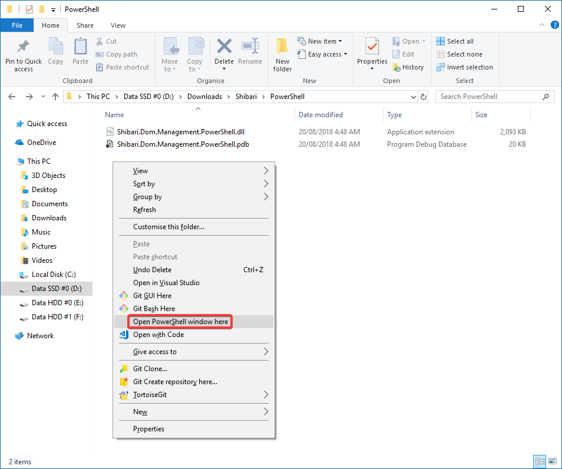
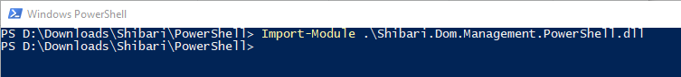

# Bluetooth Pairing with Shibari

Navigate to the `PowerShell` subfolder within the directory you extracted Shibari to, hold the `Shift` key and right-click into the folder, giving you the `Open PowerShell window here` option:



You're then greeted by a new PowerShell where you enter the following command:

```PowerShell
Import-Module .\Shibari.Dom.Management.PowerShell.dll
```



This loaded the logic required for pairing.
