# ViGEm Bus Driver Installation – caveman edition

If the path of the PowerShell failed you; don’t worry, we’ve got your back! 😉

*Draft, hehe*

## Preparations

First of all grab the driver files: [ViGEmBus_signed_Win7-10_x86_x64_latest.zip](https://downloads.vigem.org/.stable/latest/windows/x86_64/ViGEmBus_signed_Win7-10_x86_x64_latest.zip)

Attention: This link will change in the near future, come back here if you get the 404 😉

Extract the archive:

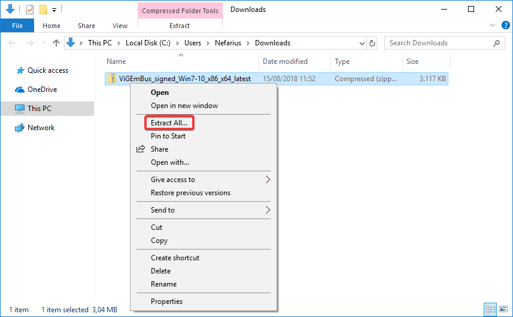

Which will leave you with this folder structure:

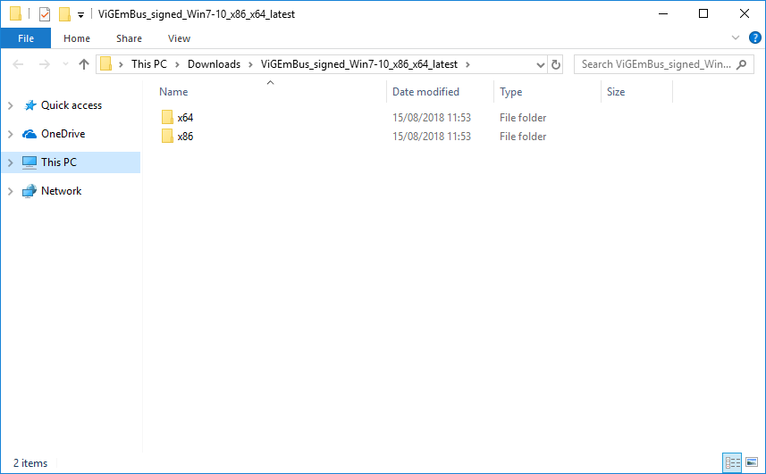

Keep that path noted, we'll require it later on.

## The way of the GUI (Windows Device Manager)

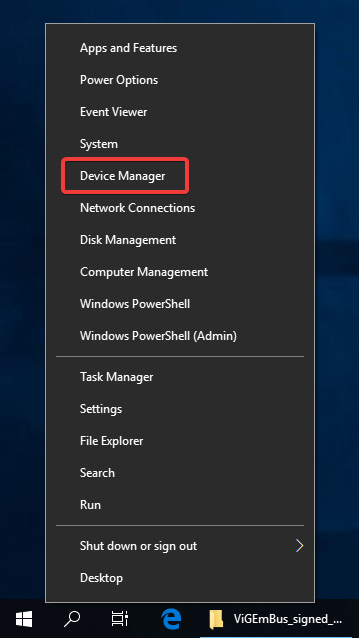

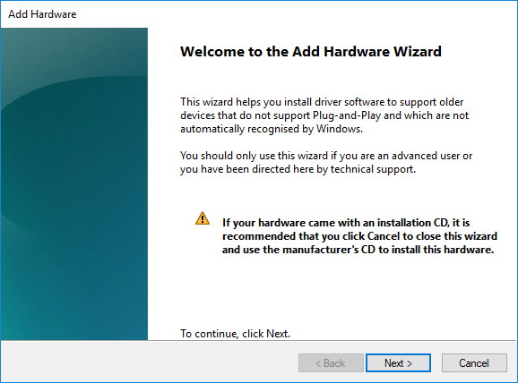

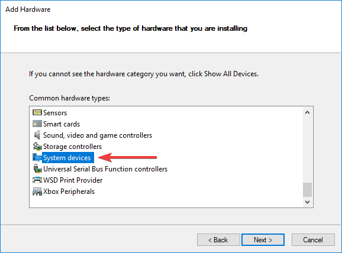

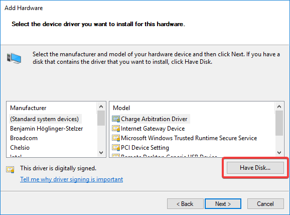

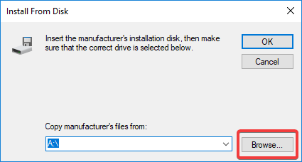

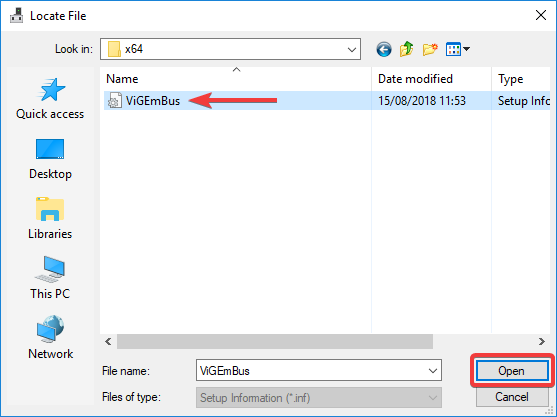

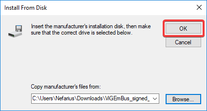

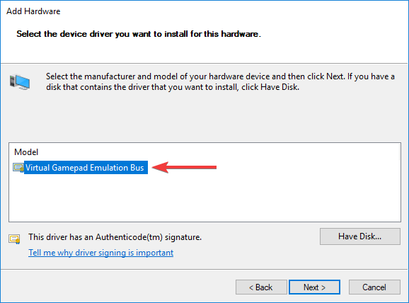

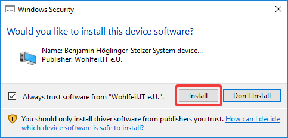

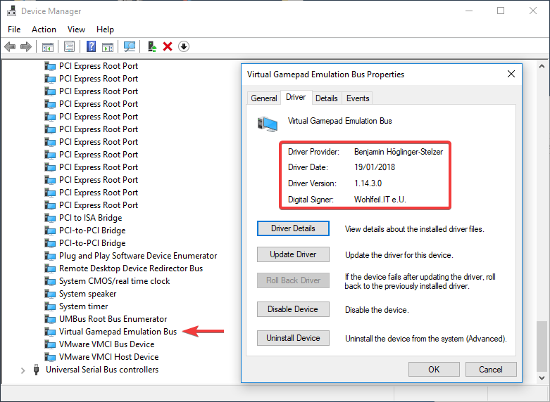

## The path of command-line (devcon)

Yo!
