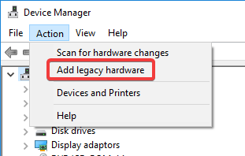
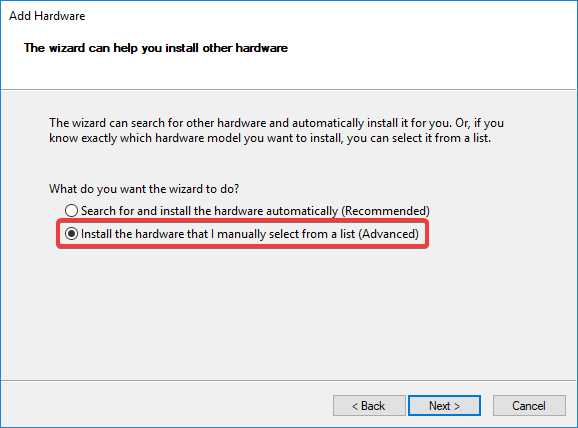

# ViGEm Bus Driver Installation – caveman edition

If the path of the PowerShell failed you; don’t worry, we’ve got your back! 😉

## Preparations

👉 First of all grab the driver files: [ViGEmBus_signed_Win7-10_x86_x64_latest.zip](https://downloads.vigem.org/.stable/latest/windows/x86_64/ViGEmBus_signed_Win7-10_x86_x64_latest.zip)

Attention: This link will change in the near future, come back here if you get the 404 😉

Extract the archive:


Which will leave you with this folder structure:


Keep that path noted, we'll require it later on.

## The way of the GUI (Windows Device Manager)

The Windows Device Manager is a management tool that's been built into Windows for ages. You can pretty much accomplish almost all device and driver management tasks with it. Depending on your version of Windows [there are multiple ways to open it](https://www.computerhope.com/issues/ch000833.htm); on Windows 10 you can simply right-click on the Windows logo in the taskbar or press the keyboard combination `Win + X`. A menu will po-up where you can fire up Device Manager:


The task we're seeking after is hidden under the `Action` menu and (a tad the misleading) named `Add legacy hardware`:



A wizard pops up greeting you with a page you can skip 😊


Choose the radio button `Install the hardware that I manually select from a list (Advanced)`.

Don't worry, it won't get that "advanced", I promise 😜



Now scroll down and select `System devices`:


Ignore the Manufacturer and Model entries, hit `Have Disk...` instead:


Now insert the driver floppy disk. Wait, no 🤨 We don't use floppies anymore, what a shame! Remember where you extracted the driver files previously? Yeah, hit `Browse...`:


Now instead of digging up your dusty floppy drive navigate to the driver path until you get the `ViGEmBus` entry, select it and hit `Open`:


Confirm once more with `OK`:


Now the dialog has changed like presented. You can go to the next screen:


One last confirmation page and the fun begins, click next:


It's doing something! Exciting! 😃


👮 If you've never installed the driver before, Windows would like you to confirm that you trust the publisher (me). 

You do trust me, right? Right?! 😰


Oh my! Looks like we did it! 🎉


You should now find a new device named `Virtual Gamepad Emulation Bus` under the `System devices` node:


That's it! You've done it! Congratulations on your effort to finish this journey 😄 Go have fun playing your 🕹️ now!

## The path of command-line (devcon)

The `devcon` utility is a small console program for common driver tasks created by Microsoft. The tool is unfortunately only "officially" redistributed by the rather huge Windows SDK. I'm hosting a copy you're invited to use so you don't need to install gigabytes of stuff you won't need 😁

👉 [Download devcon](https://downloads.vigem.org/other/microsoft/devcon.zip)

Extract the archive to a location of your choice (e.g. `C:\devcon`) so you'll end up wit the tool here:


[Fire up PowerShell as Administrator](https://www.top-password.com/blog/5-ways-to-run-powershell-as-administrator-in-windows-10/) and execute the following command:

```text
C:\devcon\x64\devcon.exe install "D:\Downloads\ViGEmBus\x64\ViGEmBus.inf" Root\ViGEmBus
```

Make sure the paths used in the example match your system. Execution will then looks similar to this:


And you're done! 🎉

## How do I get rid of this

Bus-Chan is sad to see you go 😿 but here's how to do it.

In Device Manager, expand the `System devices` node and scroll to the `Virtual Gamepad Emulation Bus` entry.

Right-click on it and select `Uninstall device`:


Make sure to tick the box to also remove the driver files:


That's it! A reboot might be required for the removal to complete.
