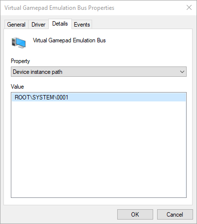

# ViGEm Bus Driver Installation

Hint: if the instructions described here fail you [check out the caveman edition](vigem-bus-driver-installation-caveman-edition.md)!

## How to install ViGEm Bus & Drivers

The `ViGEm` drivers can be installed and updated via Windows built-in [PowerShell](https://docs.microsoft.com/en-us/powershell/scripting/getting-started/getting-started-with-windows-powershell). [You need at least PowerShell v5](https://docs.microsoft.com/en-us/powershell/wmf/5.1/install-configure) for the following commands to work (already included in Windows 10). Once prepared [fire up PowerShell as Administrator](https://www.top-password.com/blog/5-ways-to-run-powershell-as-administrator-in-windows-10/) and follow the next steps.

Attention: 🔥 if you're **not on Windows 10** please make sure you have [all dependencies installed](https://docs.microsoft.com/en-us/powershell/wmf/5.1/install-configure) before you continue!

👉 First update the package provider:

```PowerShell
(Install-PackageProvider -Name NuGet -MinimumVersion 2.8.5.201 -Force).Status
```

After a few moments of downloading it should simply return `Installed`

👉 Then add the repository:

```PowerShell
. ({ Register-PSRepository -Name nuget.vigem.org -SourceLocation "https://nuget.vigem.org/" -InstallationPolicy Trusted },{ "Repository already registered, nothing to do =)" })[(Get-PSRepository -Name nuget.vigem.org -ErrorAction Ignore).Registered -eq $true]
```

👉 Now install the `ViGEmManagementModule`:

```PowerShell
Install-Module ViGEmManagementModule -Repository nuget.vigem.org
```

👉 Finally setup the Virtual Gamepad Emulation Bus and Driver via these commands:

```PowerShell
Add-ViGEmBusDevice
Install-ViGEmBusDeviceDriver
```

If you don’t get any errors back, the installation succeeded. You can check if the bus is there like so:

```PowerShell
Get-ViGEmBusDevice
```

This should spit out something like this:

```text
DevicePath         : \\?\ROOT#SYSTEM#0006#{96E42B22-F5E9-42F8-B043-ED0F932F014F}
InstanceId         : ROOT\SYSTEM\0006
DeviceName         : Virtual Gamepad Emulation Bus
DriverVersion      : 1.14.3.0
Manufacturer       : Benjamin Höglinger-Stelzer
DriverProviderName : Benjamin Höglinger-Stelzer
```

The InstanceId is specific to your system and may vary. Likewise the version.

## How to remove device & drivers

Sometimes you have to let go. If you simply wanna purge all devices from your system, execute:

```PowerShell
Get-ViGEmBusDevice | Remove-ViGEmBusDevice
```

This will remove all bus instances found.

If you want to be a bit more specific, call it with a parameter:

```PowerShell
Remove-ViGEmBusDevice -InstanceId ROOT\SYSTEM\0001
```

Where `InstanceId` can be obtained from Device Manager:



If you encounter any problems, don’t hesitate to hop onto Discord and ask for help 😀
