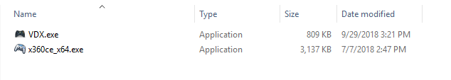
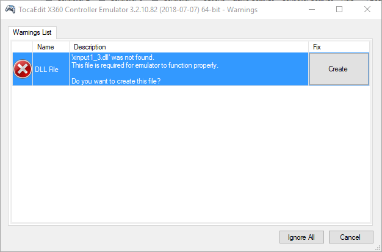
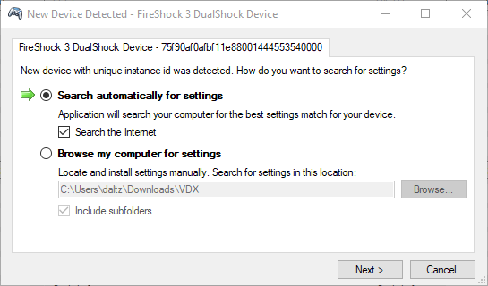
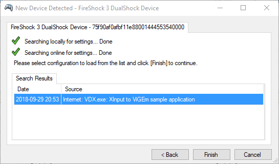
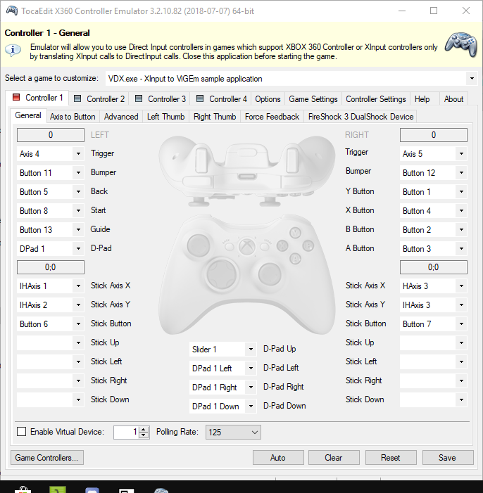
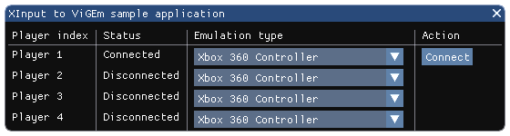
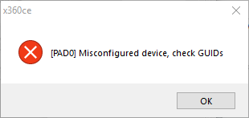

# x360ce to ViGEm

VDX is a ViGEm Feeder Application designed to create a System-Wide XBox360 or DualShock 4 joystick

## Target Audience

- Windows 7 is the minimum OS version. Don't expect anything lower to be able to work 😉

## Prequisites

- Setup [ViGEm Bus Driver](https://docs.vigem.org/#!vigem-bus-driver-installation.md) if you haven't already
- Download and Install [Microsoft Visual C++ Redistributable for Visual Studio 2017](https://visualstudio.microsoft.com/de/downloads/)
- Download and Install all of x360ce required dependencies. A list can be found [here](https://github.com/x360ce/x360ce#system-requirements)

## Download VDX and x360ce

- Please grab the appropriate build for your version of Windows. If in doubt, choose x32 or x86 bit builds.
- Download the latest VDX application from [here](https://buildbot.vigem.org/builds/VDX/master/) (select the highest version number for the latest edition)
- Download the latest x360ce application from [here](https://github.com/x360ce/x360ce#download)

## How to use

It's not that hard. I swear! 😃

### Gather the files

Attention: Extract x360ce to its own folder and copy VDX into the same folder (e.g. `Downloads\x360ce`). The only things that should be in this folder are the x360ce application (and any files it generates) and the VDX application. Do **NOT** copy these files into any game directories like you might be used to.

### Configuring x360ce

- Open the x360ce_x64 application and create the DLL that it prompts you to. 

- You will be prompted to search the internet for default settings. Press next and finish through the dialog.

- Configure your joystick controls.

- In some cases where VDX does not detect your controller, you may need to press the `auto` button in the bottom right of the application before you modify the controls.
- Save and close out of x360ce

### Enabling VDX

👉 Open VDX and press connect

## Troubleshooting

`[Pad0] Misconfigured Device, check GUIDs`

👉 Delete x360ce.ini and xinput1_3.dll from the application directory and relaunch x360ce
